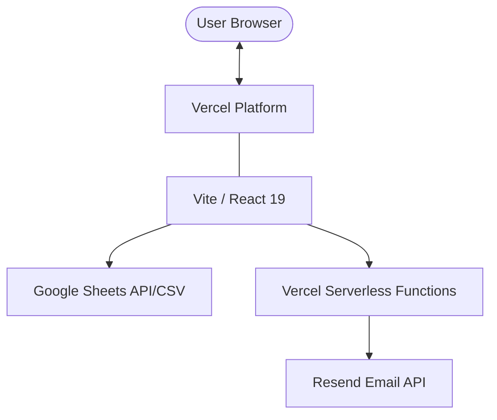

# Architecture Overview

The Trilemma Foundation website is a modern, high-performance web application built with a focus on speed, accessibility, and data-driven content.

## System Model

## Core Components

### Frontend (React/Vite)
- **Framework**: React 19 with TypeScript.
- **Build Tool**: Vite for fast development and optimized production builds.
- **Routing**: React Router v7 with lazy-loaded routes for minimal initial bundle size.
- **Styling**: Tailwind CSS for a utility-first design system, customized via `tailwind-ui-kit.preset.ts`.

### Backend (Serverless)
- **Functions**: Located in the `api/` directory, deployed as Vercel Serverless Functions.
- **Email**: The `send-email.ts` handler integrates with **Resend** to deliver job applications.
- **Rate Limiting**: IP-based rate limiting implemented in-memory for the API layer.

### Data Layer
- **External Source**: Many data-driven components (Projects, Capstones, Team) fetch data directly from Google Sheets via CSV export links.
- **Fetching Logic**: Custom hooks (e.g., `useProjectsData`) handle the fetching, parsing (via `csvParser.ts`), and state management.

## Performance Philosophy
- **Lazy Loading**: All major pages are lazy-loaded.
- **Static First**: The site is largely static, using client-side fetching for dynamic data to keep the initial load fast.
- **Minimal Dependencies**: We prioritize lightweight libraries like `date-fns` and `tanstack-table` to keep the bundle lean.
