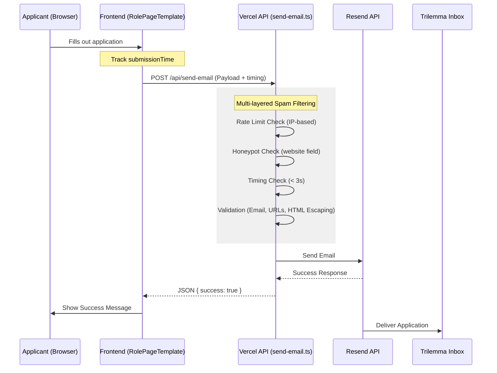

# Email Sending Flow & Spam Prevention

This document describes the application submission flow used for job applications, including the frontend implementation, the backend API, and the multi-layered spam prevention measures.

## System Overview

The flow is designed to securely capture job applications and deliver them to the Trilemma team via email using [Resend](https://resend.com).



## Frontend Implementation

**File:** [`RolePageTemplate.tsx`](file:///Users/mattfaltyn/Desktop/hypertrial_trilemma/foundation/website/src/components/pages/careers/roles/RolePageTemplate.tsx)

- **Submission Timing**: The component records `startTime` when mounted. On submission, it calculates `submissionTime = Date.now() - startTime`. This is sent to the backend to filter out instant bot submissions.
- **Honeypot Field**: A field named `website` is included in the form. It is visually hidden from users using accessibility-friendly CSS (opacity 0, absolute positioning) but remains visible to scraping bots. If this field is filled, the submission is flagged as spam.

## Backend Implementation

**File:** [`send-email.ts`](file:///Users/mattfaltyn/Desktop/hypertrial_trilemma/foundation/website/api/send-email.ts)

The API handler is responsible for final validation and delivery.

### Security & Spam Prevention Measures

1.  **In-Memory Rate Limiting**: Limit of 5 requests per 15 minutes per IP address. This prevents brute-force abuse of the email API.
2.  **Honeypot Verification**: Silently discards submissions where the `website` field is populated.
3.  **Timing Verification**: Discards submissions that took less than 3 seconds to complete.
4.  **Strict Validation**:
    - **Regex Email Validation**: Ensures the primary email is correctly formatted.
    - **URL Validation**: Ensures links to Resumes, GitHub, and CVs are valid URLs.
    - **HTML Sanitization**: All user-provided text is escaped before being injected into the HTML email template to prevent styling or scripting injection.
5.  **IP Logging**: The source IP address is included at the bottom of the internal email for tracing purposes.

## Configuration

The following environment variable must be set in Vercel:

- `RESEND_API_KEY`: Your production Resend API key.

## Testing

Comprehensive unit tests cover all security layers and validation logic.

```bash
# Run the specific test suite
npm test api/send-email.test.ts
```

The tests verify:
- Rate limit enforcement.
- Honeypot and timing traps.
- Valid/Invalid input handling.
- Integration with the Resend client.
